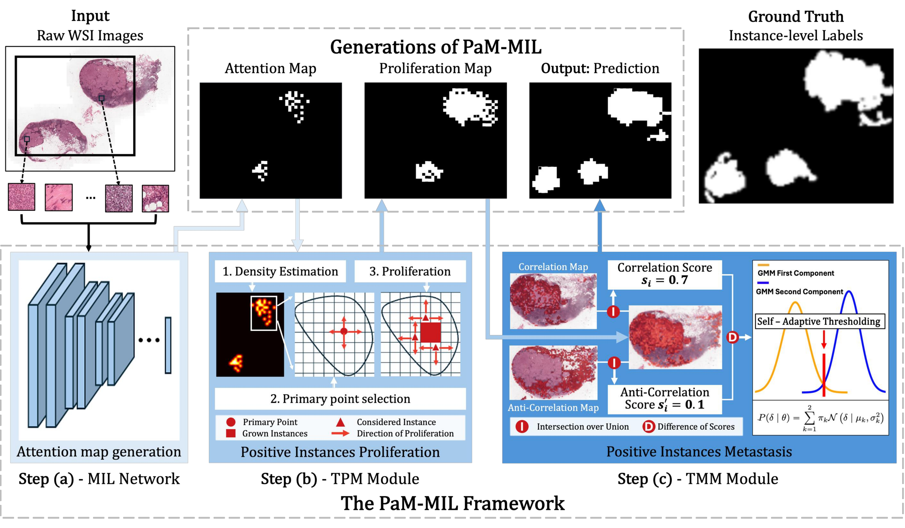

<h1> PaM-MIL: Proliferation and Metastasis Enhanced Localization for Multiple Instance Learning on Pathology </h1>

[Pengyu Guo](pguo657@connect.hkust-gz.edu.cn) · [Jiachuan Wang*](jwangey@cse.ust.hk) · [Zhao Chen](chenzhao@hkust-gz.edu.cn) · [Caleb Chen Cao](caochen.hkust@gmail.com) · [Liping Wang](lwang347@connect.hkust-gz.edu.cn) · [Tingyi Jiang](tjiang622@connect.hkust-gz.edu.cn) ·   [Lei Chen](leichen@cse.ust.hk)

*Corresponding Author

## Description

**PaM-MIL** is a biologically inspired framework that explicitly enhances positive-instance localization by mirroring the biological tumor growth process. The framework integrates two complementary modules: a Tumor Proliferation Module (TPM) that mitigates localization sparsity, and a Tumor Metastasis Module (TMM) that recovers small and scattered regions overlooked by MIL models.

<!-- Use Figure 1: framework overview -->

    
  

## Key Components

- **Tumor Proliferation Module (TPM)**: TPM first identifies primary points using a density-based primary point identification strategy, where tumor density increases as one moves closer to the primary
point and decreases toward the boundary of the tumor region. Then, to mimic the tumor proliferation process, TPM introduces an efficient iterative propagation solver that scales label propagation to WSIs, avoiding the high computational complexity induced by the massive number of instances.
- **Tumor Metastasis Module (TMM)**: TMM introduces a Bicorrelation Measurement (BcM) strategy that jointly computes the correlation and anticorrelation between instances and tumor regions to purify the signal. Then, TMM applies a Self-adaptive Thresholding (SaT) mechanism to dynamically accommodate slide-specific variations in discriminative signals.
